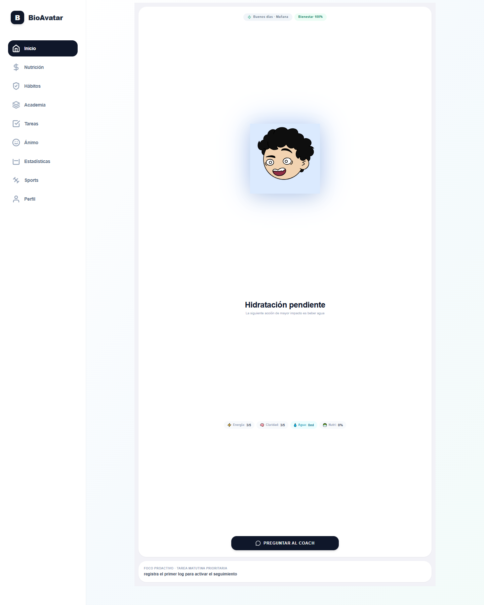

# coach-mascota

Bio-Avatar is a Next.js dashboard for tracking daily habits, nutrition notes, mood and basic wellness routines.

The app combines a guided interface with lightweight coaching flows. Some routes depend on Supabase and AI-related environment variables, so local setup requires configuration before all features can be exercised.

## Screenshot



## Social preview

GitHub social preview asset: `public/og-image.png`

## Local development

```bash
npm install
npm run dev
npm run build
```

## Checks

- prebuild validation
- TypeScript
- production build
- Playwright E2E tests

## Links

- DeepWiki: https://deepwiki.com/eneekoruiz/coach
