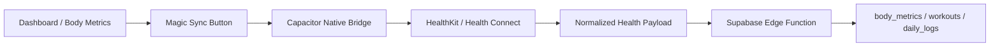
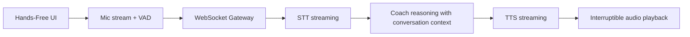
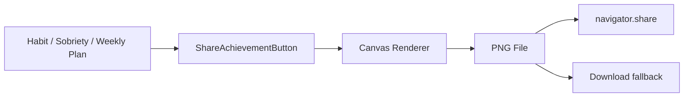

# UF Frontier Architecture

## 1. Zero-Input Health

### Viabilidad inmediata real
- **Apple HealthKit**: no accesible directamente desde una app web Next.js/PWA.
- **Android Health Connect / Google Fit**: tampoco de forma fiable desde web pura.
- **Conclusión**: para una sincronización real de pasos, sueño, peso y workouts hace falta un **shell nativo**.

### Ruta recomendada
1. Empaquetar la app actual con **Capacitor**.
2. Añadir plugins nativos:
   - iOS: `@perfood/capacitor-healthkit` o plugin propio de HealthKit.
   - Android: plugin propio de **Health Connect** o conector equivalente de Capacitor.
3. Leer datos nativos en background:
   - pasos
   - sueño
   - peso y antropometría
   - workouts
4. Subir lotes a Supabase con una **Edge Function** autenticada.

### Flujo de datos

### Tablas destino
- `body_metrics`
- `workouts`
- `daily_logs` para pasos, sueño resumido y contexto del coach

### Worker / background
- iOS: background fetch nativo
- Android: WorkManager
- Edge Function: validación, deduplicación e upsert por fecha

## 2. Real-Time AI Coach

### Viabilidad inmediata real
- El dictado híbrido actual sirve para una web PWA.
- El modo manos libres continuo con interrupción, VAD y TTS natural necesita **streaming bidireccional**.

### Ruta recomendada
- Cliente web/nativo:
  - `MediaRecorder` + Web Audio API para captura
  - VAD local con `@ricky0123/vad-web`
- Transporte:
  - **WebSocket** para audio chunked bidireccional
  - alternativa ligera: **SSE** solo para salida de texto, pero no es ideal para audio full duplex
- Backend:
  - un worker Node con WebSocket gateway
  - STT/TTS/LLM en streaming

### Flujo recomendado

### Stack sugerido
- VAD: `@ricky0123/vad-web`
- WebSocket server: `ws` o gateway en Supabase Realtime no orientado a audio
- TTS/STT: proveedor con streaming real
- Contexto: historial ya persistido en Supabase

## 3. Viral Share Loop

### Viabilidad inmediata
- **Sí, totalmente viable ya** en la app actual.
- Se implementa en cliente con `canvas`, `File`, `navigator.share` y fallback de descarga.

### Flujo

### Estado actual implementado
- Botón de compartir en hábitos positivos
- Botón de compartir en reloj de sobriedad
- Botón de compartir en planes semanales
- Render premium oscuro con branding BioAvatar
